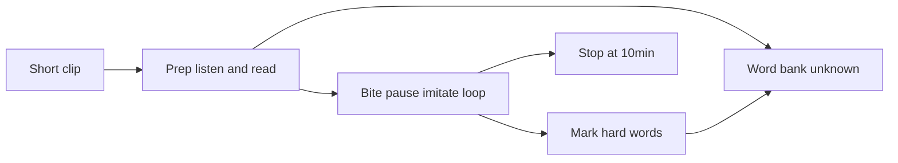

# Echo MVP Plan

Personal Echo Method trainer based on [doc/echo.md](doc/echo.md).

**Overview:** bite → echo pause → imitate → ~10 min/day. Unknown words: in-app US pronunciation + gloss (not forced jump); save to 生词/错词本 for review. Cambridge/YouGlish as secondary links.

## Build checklist

- [x] BRIEF: echo ritual + in-app pron lookup + word bank review
- [x] Scaffold Flask + Vite React, `.env.example`, `data/` incl `lexicon.json`
- [x] Echo Session: play ~4–5 words → echo pause → speak → loop → next; 10-min timer
- [x] Tap word: in-app US audio + IPA + gloss_zh; Save 生词; optional Cambridge/YouGlish
- [x] Word bank list `unknown` | `hard` + light review (replay audio / open bite)
- [x] URL ingest short clips + transcript; segment ~4–5 word bites
- [ ] Optional later: post-echo record → tip → auto hard words

---

# Echo MVP — [doc/echo.md](doc/echo.md) + 词本

产品核心仍是史嘉琳 **回音法**。词相关增量：

- **不认识的词：应用内标音 / 试听**（默认不跳出页面）
- **一键加入生词本**，之后可复习
- Cambridge / YouGlish 降为浮层里的**次要**外链（需要更多例句时再开）

## 回音法 vs 跟着念（不变）

| | 跟着念 / delay-shadow | 回音法（默认） |
|--|----------------------|----------------|
| 时机 | 音未停就开口 | **先停**，听心里回音再开口 |
| 块长 | 常整句 | **约 4～5 词** |
| 时长 | 易超时 | **约 10 分钟/天** |

## 用户仪式

1. 选短、感兴趣的美式材料（约 1–3 分钟）
2. 整段先听几遍
3. **读懂文字**：点生词 → **页内听 US 发音 + 见音标/注音 + 一句中文** → **加入生词本**；直到文意清楚再进 Echo
4. 播 ≤4–5 词 → **Echo 停顿** → 模仿回音 → 同一块练到溜 → 下一块
5. 觉得难发的词/短语 → 标 **错词** 进错词本
6. 满约 10 分钟结束；空闲时可打开 **词本复习**（再听词音 / 跳回原 bite）

## In (v1)

1. **Inbox** — URL / 本地短音频；最近练习
2. **Prep** — 全文 + 整段播放；点词查阅并入库
3. **Echo Session** — Play bite → Echo wait → Speak → Loop / Next → 10:00 计时
4. **Word bank（生词/错词本 + 轻复习）**
   - `unknown` 生词：Prep 点词「加入生词本」
   - `hard` 错词：Echo 中手动标难发
   - 列表筛 全部/生词/错词；每行可 **再播词音**、Open bite、次要链 Cambridge/YouGlish
   - **复习**：词本页点词再听 US 音 + 看 gloss（不做复杂 SRS；v1 就是可回看的本）

**点词查阅（应用内优先，不强制跳转）**

浮层默认展示：

1. **Play US** — 应用内播放单词发音（字典 API 的 US audio URL，如 Free Dictionary / 同类；失败再用浏览器 TTS `en-US`）
2. **音标或简易注音**（API 的 IPA / phonetic）— 辅助，主仍靠听
3. **一句语境中文 gloss**（LLM 或短释义）
4. 主按钮：**加入生词本**（或已在本中则显示「已收藏」）
5. 次要文字链：Cambridge · YouGlish（可选深挖，不挡主路径）

Prep 全文也可对已入库生词做轻量角标（小点），方便扫读，不强制。

**词库字段**

| Field | 例 |
|-------|----|
| `surface` | `vulnerability` / `kind of` |
| `kind` | `unknown` \| `hard` |
| `gloss_zh` | 一句中文 |
| `ipa` / `audio_url` | 缓存便于复习离线感（有则存） |
| `context` | source_id + timestamp + clause |
| `count` / `updated` | 重复遇见累加 |

## Out (仍不做 / 延后)

- 默认 delay-shadow、三模式、弱项跳转大盘
- Anki 同步、完整 SRS
- Azure 打分作为 v1 必选项（回音闭环 + 词本先跑通）
- **v1 先本机跑通**；Cloudflare 为部署目标见下，不阻塞开发

### Cloudflare（可以 — 混合）

| 部分 | CF | 说明 |
|------|-----|------|
| 前端 | **Pages** | Vite React |
| 薄 API | **Worker** | lexicon CRUD、lookup 代理、gloss |
| 媒体/字幕 | **R2** | audio + transcript + bites |
| 元数据 | **D1 / KV** | sources、词本 |
| yt-dlp / Whisper / ffmpeg | **不能**靠普通 Worker | 本机 ingest 后上传 R2，或以后 Container |

个人用时加 **Cloudflare Access**，只给你自己。Secrets 放 Worker，不要进前端。

## Design

**Visual system = 第一版 Shadow mock 的气质**（用户反馈更好看），交互流程 = 回音法四屏。

- 暖白 / 奶油底 + 炭色顶栏 + **muted teal**；衬线标题 / 无衬线控件
- **不要**暗色霓虹 Session、厚侧栏仪表盘、紫色 AI 风、进度游戏化
- Echo 停顿态仍是焦点；词本用轻列表，点词用轻浮层

### Design result (prefer v3 light / early Shadow look)

Mock assets (Cursor project):

- Inbox — `echo-v3-inbox.png`（气质对齐早期 `design-inbox.png`）
- Prep — `echo-v3-prep.png`
- Echo Session — `echo-v3-session.png`（浅色，非暗绿发光稿）
- Word bank — `echo-v3-wordbank.png`

**Screen contracts**

1. **Inbox** — paste · Start prep · recent
2. **Prep** — transcript · play full · tap → **in-app US audio + IPA + gloss** → **Save 生词** ·（次要）Cambridge/YouGlish · Begin Echo
3. **Echo** — ~4–5 words · Play → **听回音…** → Loop/Next · 10:00 · 可标错词
4. **Word bank** — 全部/生词/错词 · **复习再听** · Open bite · 外链次要

## Tech

| Need | Choice |
|------|--------|
| UI | Vite React（Inbox / Prep / Echo / Word bank） |
| API | Flask：ingest, chunks, lexicon, lookup（音+IPA+gloss） |
| Ingest | yt-dlp + captions/Whisper；短窗 |
| Segment | ~4–5 word bites |
| Word audio/IPA | Dictionary API US audio（失败则 `speechSynthesis` en-US） |
| Gloss | LLM 一句语境中文（可选） |
| External | Cambridge / YouGlish 次要链接 |
| Data | `data/sources/` + `data/lexicon.json` |

**Build order：** Echo Session fixtures → 点词应用内发音 + 生词本 → Prep/Inbox → ingest →（可选）录音 tip → `hard`。

## Success

每天约 10 分钟回音能做完；生词**不用跳转**就能听发音并入库；词本可复习再听；难词可进错词本并回到 bite。

## 文档

方法以 [doc/echo.md](doc/echo.md) 为准；查词以应用内听音为主，Cambridge/YouGlish 为辅。
